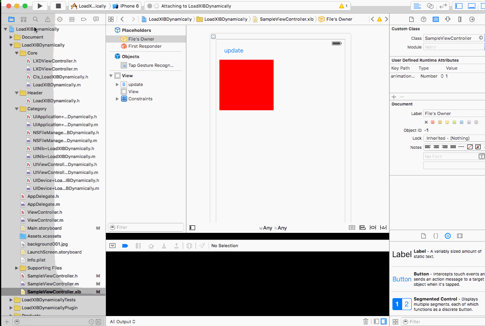

# Load XIB Dynamically (LXD) iOS

LXDはコンパイルすることなくXIBファイルをローディングするライブラリです。
コンパイルせずにビューを更新できるので、データを読み込んでの動作確認、アニメーションを含めた動作確認が行いやすくなります。

# Demo



# Install

```ruby

pod 'LoadXIBDynamically', git: 'https://github.com/hmuronaka/LoadXIBDynamically.git'

```

# Prepare

## Objective-C

### AppDelegate.m

```obj-c

// AppDelegate.m

#import "UIApplication+LoadXIBDynamically.h"

@interface AppDelegate ()
@end

@implementation AppDelegate

- (BOOL)application:(UIApplication *)application didFinishLaunchingWithOptions:(NSDictionary *)launchOptions {
  [[UIApplication sharedApplication] lx_setupWebDAVServer]; // <-- add
  return YES;
}
```

### Target ViewController

```obj-c

#import "LXDViewController.h" // <-- add
@interface ViewController: LXDViewController <-- change from UIViewController to LXDViewController

```

or

```obj-c

#import "UIViewController+LoadXIBDynamically.h"

@interface ViewController: UIViewController
@end

@implementation ViewController

-(void)loadView { // <-- add
  if(![self lx_loadView]) {
    [super loadView];
  }
}

@end

```

## Swift

### Bridging-Header

```obj-c
// YourProject-Bridging-Header.h

#import <LoadXIBDynamically/LoadXIBDynamically.h>

```

### AppDelegate

```swift
// AppDelegate.swift

   
   func application(application: UIApplication, didFinishLaunchingWithOptions launchOptions: [NSObject: AnyObject]?) -> Bool {
      UIApplication.sharedApplication().lx_setupWebDAVServer() // <-- add
  }
```

### ViewController

```swift

// ViewController.swift

import LoadXIBDynamically // <-- add

class ViewController: LXDViewController // <-- change from UIViewController to LXDViewController
```

or

```swift

class ViewController: UIViewController {

  override func loadView() { // <-- add
    if(!self.lx_loadView()) {
      super.loadView()
    }
  }
  
}

```

# Usage

1 アプリを起動します。

2 XIBを編集して保存します。

3 XIBファイルをコンパイルして、アップロードします。


```bash

$ > ibtool MyViewController.xib --compile MyViewController.xib.lxd # 拡張子は.xib.lxdの必要があります。
$ > curl -T MyViewController.xib.lxd http://your iOS ipaddress:8080/

```

4 当該ビューを再表示します。

# LICENSE

MIT LICENSE
